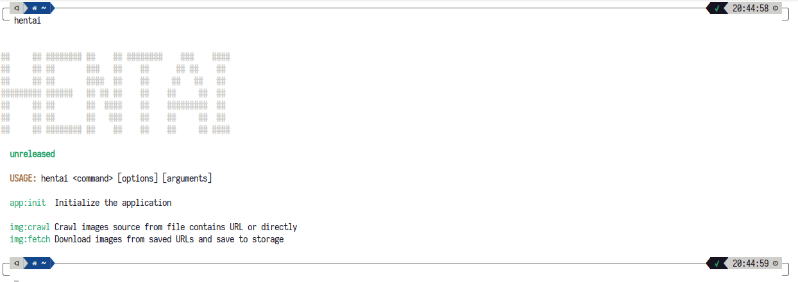
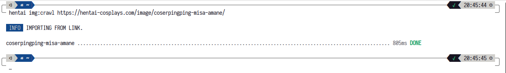
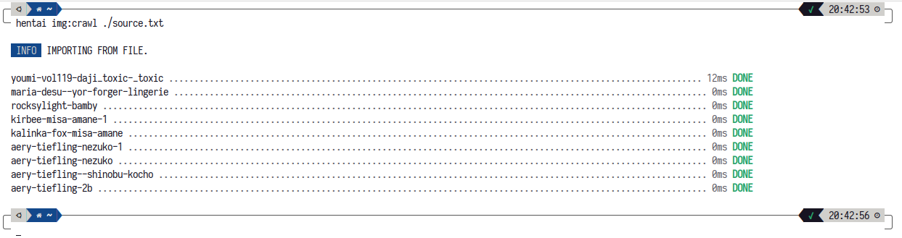

# Hentai Downloader

## Requirements

- SQLite3
- PHP 8.1 with curl, sqlite3, and mbstring extensions

## Installation

Download the latest release from the [releases page](https://github.com/SupianIDz/HentaiCosplay/releases).

## Usage

```bash
php hentai
```



### Crawl URLs

First, you need to crawl the URLs from the website. You can crawl a single URL using the following command.

```bash
php hentai img:crawl https://hentai-cosplays.com/image/coserpingping-misa-amane/
```



or you can crawl multiple URLs at once using a text file containing the URLs line by line.

```bash
php hentai img:crawl source.txt
```



### Getting Images

After crawling the URLs, you can download the images using the following command.

By default, the images will be downloaded to the `~/.hentai/images` directory.

```bash
php hentai img:fetch
```

or you can set the download directory by adding output directory as the second argument.

```bash
php hentai img:fetch ~/output/
```
